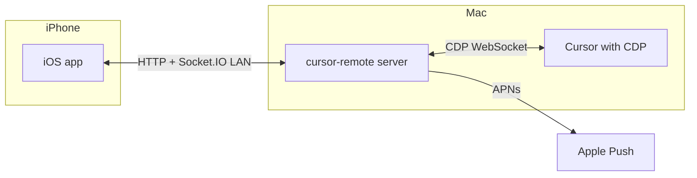

# Cursor Remote

Remote control and notifications for **Cursor** on your Mac from an **iPhone** app on the same network. A small **Node.js service** bridges HTTP, Apple Push (APNs), **Socket.IO** realtime, and **Chrome DevTools Protocol (CDP)** automation against Cursor’s UI.

This repo is a **monorepo**: TypeScript libraries and the service live under `shared/` and `server/`; the VS Code/Cursor **extension** under `extension/`; the **iOS** app under `ios/cursor-remote/`.

---

## What it does (mental model)

| Layer | Role |
|--------|------|
| **iOS app** | Pairing QR, push token registration, optional chat UI that talks to the service over **HTTP + WebSocket (Socket.IO)**. |
| **`server/`** | Long-running process: pairing API, device registry, APNs delivery, DOM watcher (agent idle), and **injecting chat into Cursor + streaming replies** via CDP. |
| **`shared/`** | Compiled TypeScript package (`@cursorremote/shared`): pairing server, realtime protocol, CDP helpers, DOM probes—included by `server` (and buildable independently). |
| **`extension/`** | Optional: start the service, show pairing QR in the editor, hit the same HTTP API as the phone. |

**Traffic shape**

1. **Pairing**: Phone scans a QR (or opens a URL) → `POST /devices` on the Mac with a **pairing token** and the phone’s **APNs device token** → server remembers the device.
2. **Push**: Server sends APNs when something interesting happens (e.g. agent idle heuristic from DOM polling).
3. **Realtime chat**: Authenticated Socket.IO connection; phone sends `message:send`; server uses **CDP** to type into Cursor’s agent composer and polls the DOM to **stream** assistant text back (`message:receive`).



---

## Who should read what

| Doc | Audience |
|-----|----------|
| **[shared/README.md](shared/README.md)** | Contributors changing pairing, DOM/CDP, or Socket.IO behavior. |
| **[server/README.md](server/README.md)** | Running and configuring the service, env vars, endpoints, keyboard shortcuts. |
| **[extension/README.md](extension/README.md)** | Using the Cursor extension to spawn or talk to the service from the IDE. |

---

## Prerequisites (typical dev setup)

- **macOS** with **Cursor** (or VS Code–compatible host) for CDP features.
- **Node.js** (18+ recommended; global `fetch` is used in shared code).
- **Xcode** for the iOS target.
- Same **LAN** for phone ↔ Mac when using local IPs in the QR payload.
- **APNs**: a `.p8` key and correct bundle ID for real pushes (see server README).

**Cursor with remote debugging** (needed for agent inject + DOM watcher):

```bash
open -a Cursor --args --remote-debugging-port=9222
```

---

## Quick start: run the service

From the repo root:

```bash
cd shared && npm install && npm run build
cd ../server && npm install && npm run dev
```

If you use **Bun**, `bun install` / `bun run build` in each package works the same idea (this repo may ship `bun.lock` files).

The service prints a **pairing URL** and QR payload. Point the iOS app at the Mac’s address (e.g. `http://192.168.x.x:31337`—see [server/README.md](server/README.md)).

---

## Quick start: iOS app

Open **`ios/cursor-remote/cursor-remote.xcodeproj`** in Xcode, select your device or simulator, build and run. Pair using the in-app scanner and the payload shown by the server (or extension).

---

## Security & expectations

- Pairing uses a **shared secret** (`CURSOR_REMOTE_PAIRING_TOKEN`); treat it like a password on your LAN.
- **CDP + DOM automation** depends on Cursor’s internal HTML. Cursor updates can **break** selectors until the code is updated—see [shared/README.md](shared/README.md).
- Do **not** commit APNs `.p8` keys or secrets to a public repo.

---

## License / ownership

Project-specific; add a `LICENSE` file at the root if you distribute this repo.
